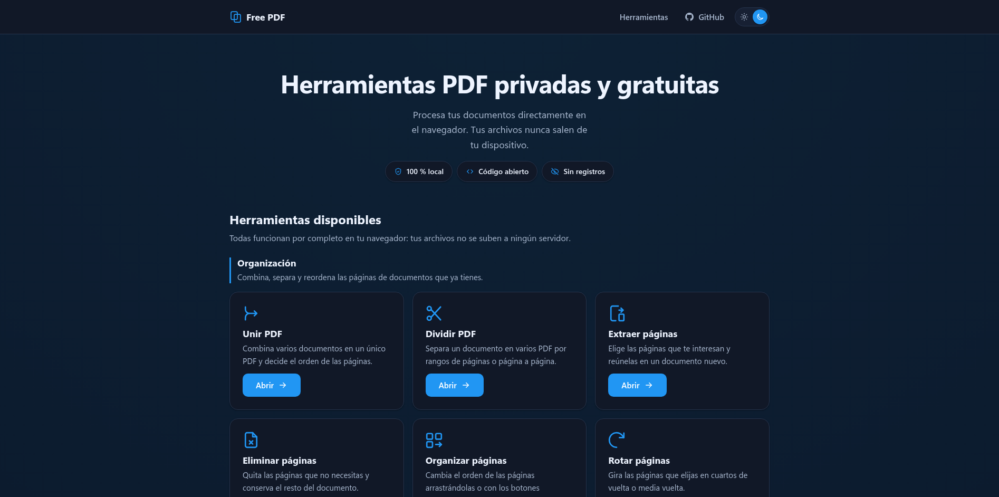

# Free PDF

Herramientas PDF privadas, gratuitas y de código abierto que funcionan
completamente en el navegador.

Tus documentos no se suben, no se almacenan y no se envían a servicios de
terceros. Free PDF es una aplicación web estática: toda operación ocurre en tu
dispositivo.

[](https://github.com/Felipe-Moreno-Marciales/free-pdf/actions/workflows/desplegar.yml)
[](LICENSE)
[](docs/PWA.md)
[](#privacidad-por-arquitectura)

**[Abrir Free PDF](https://felipe-moreno-marciales.github.io/free-pdf/)**



## Contenido

- [Por qué Free PDF](#por-qué-free-pdf)
- [Herramientas](#herramientas)
- [Privacidad por arquitectura](#privacidad-por-arquitectura)
- [Aplicación instalable](#aplicación-instalable)
- [Inicio rápido](#inicio-rápido)
- [Calidad y pruebas](#calidad-y-pruebas)
- [Arquitectura](#arquitectura)
- [Despliegue](#despliegue)
- [Documentación](#documentación)
- [Contribuir](#contribuir)
- [Licencia](#licencia)

## Por qué Free PDF

- **Privado:** los archivos permanecen en la memoria del navegador.
- **Sin cuentas:** no hay registro, backend, base de datos ni API de servidor.
- **Sin rastreo:** no incluye analítica, telemetría, publicidad ni cookies.
- **Sin CDN:** PDF.js, qpdf, OCR, tipografías y WebAssembly se sirven desde el
  mismo origen.
- **Instalable:** funciona como PWA y prepara sus herramientas para usarlas sin
  conexión.
- **Auditable:** el código, las pruebas y las decisiones técnicas son públicos.
- **Accesible y adaptable:** admite teclado, lectores de pantalla, movimiento
  reducido, temas claro y oscuro, móvil y escritorio.

Free PDF no convierte documentos de Word, Excel o PowerPoint y no incorpora
inteligencia artificial generativa. Esas funciones necesitarían un servidor o
enviar documentos a un servicio externo, lo que rompería el modelo de
privacidad del proyecto.

## Herramientas

Las 24 herramientas están implementadas y sus módulos se cargan de forma
diferida. En producción, la PWA descarga sus recursos estáticos tras la primera
carga para dejarlos disponibles sin conexión, pero los motores no se ejecutan
hasta abrir la herramienta correspondiente.

### Organización

| Herramienta | Función |
| ----------- | ------- |
| Unir PDF | Combina varios documentos y permite ordenar sus páginas. |
| Dividir PDF | Separa un documento por rangos o página a página. |
| Extraer páginas | Reúne las páginas seleccionadas en un PDF nuevo. |
| Eliminar páginas | Quita páginas y conserva el resto del documento. |
| Organizar páginas | Reordena páginas con arrastre o controles accesibles. |
| Rotar páginas | Gira páginas en cuartos de vuelta o media vuelta. |

### Creación y personalización

| Herramienta | Función |
| ----------- | ------- |
| Imágenes a PDF | Convierte JPEG, PNG y WebP en un documento PDF. |
| PDF a imágenes | Exporta páginas como PNG o JPEG. |
| Numerar páginas | Añade numeración configurable. |
| Marca de agua | Superpone texto o imágenes, una vez o en mosaico. |
| Recortar PDF | Ajusta el área visible de las páginas. |
| Escanear a PDF | Crea documentos desde la cámara o fotografías. |

### Seguridad y edición

| Herramienta | Función |
| ----------- | ------- |
| Inspector de seguridad PDF | Analiza la estructura y señala indicadores de acciones, contenido interactivo y adjuntos sensibles. |
| Proteger PDF | Cifra con AES de 256 bits y configura permisos. |
| Desbloquear PDF | Quita la protección con la contraseña correcta. |
| Formularios PDF | Inspecciona, rellena, crea y aplana campos AcroForm. |
| Censurar permanentemente | Reconstruye las páginas y elimina el contenido original. |
| Editar y anotar | Añade texto, formas y resaltados sobre las páginas. |
| Firma visual | Coloca una firma dibujada o escrita. No es una firma digital. |

### Diagnóstico y conversión

| Herramienta | Función |
| ----------- | ------- |
| Reparar PDF | Comprueba y reescribe la estructura con qpdf. |
| Comprimir PDF | Recomprime imágenes y reorganiza el documento. |
| PDF a Markdown | Extrae texto y deduce una estructura Markdown aproximada. |
| Comparar PDF | Compara texto, apariencia, medidas y metadatos. |
| OCR local | Reconoce texto en imágenes y PDF escaneados. |

La conversión PDF/A fue investigada, pero no se publica sin un validador local
que pueda demostrar conformidad con ISO 19005. La decisión está documentada en
[docs/PDFA.md](docs/PDFA.md).

## Privacidad por arquitectura

La privacidad no depende de una promesa comercial, sino de la estructura de la
aplicación:

1. GitHub Pages entrega archivos estáticos.
2. El navegador lee los documentos con `File`, `Blob` y `ArrayBuffer`.
3. PDF.js, pdf-lib, qpdf WebAssembly, Tesseract.js y `canvas` procesan los datos
   localmente.
4. El resultado se descarga mediante una URL temporal que después se revoca.
5. Al recargar la página, los documentos y resultados desaparecen de la memoria.

No se guardan archivos, contraseñas ni resultados en `localStorage`,
`sessionStorage`, IndexedDB, cookies o Cache Storage. La caché de la PWA contiene
únicamente recursos públicos de Free PDF.

La cámara solo se activa después de una acción explícita, nunca solicita el
micrófono y detiene sus pistas al salir de la herramienta.

Consulta el [modelo de seguridad](docs/SEGURIDAD.md) y los detalles del
[cifrado](docs/CIFRADO.md).

## Aplicación instalable

Free PDF es una PWA. Los navegadores compatibles permiten usar **Instalar
aplicación** o **Añadir a la pantalla de inicio**.

La compilación genera un service worker versionado que prepara 285 recursos
públicos —aproximadamente 23 MiB— para trabajar sin conexión. Esto incluye la
interfaz, PDF.js, qpdf, OCR y sus modelos locales; nunca incluye documentos de
la persona.

Más información en [docs/PWA.md](docs/PWA.md).

## Inicio rápido

### Requisitos

- Node.js 20.19 o superior, o 22.12 o superior. CI utiliza Node.js 24.
- pnpm 11.9 o superior. La versión está fijada en `package.json`.

### Instalación

```bash
git clone https://github.com/Felipe-Moreno-Marciales/free-pdf.git
cd free-pdf
pnpm install
pnpm dev
```

La aplicación queda disponible en `http://localhost:5173/free-pdf/`.

### Comandos

| Comando | Uso |
| ------- | --- |
| `pnpm dev` | Inicia el servidor de desarrollo. |
| `pnpm lint` | Ejecuta el análisis estático. |
| `pnpm tipos` | Comprueba TypeScript. |
| `pnpm pruebas` | Ejecuta todas las pruebas una vez. |
| `pnpm pruebas:vigilar` | Repite las pruebas durante el desarrollo. |
| `pnpm build` | Comprueba tipos y genera `dist/`. |
| `pnpm preview` | Sirve localmente el artefacto de producción. |

pnpm es el gestor obligatorio. No se deben generar archivos de bloqueo con npm
o Yarn.

## Calidad y pruebas

La integración continua ejecuta una instalación reproducible, lint, pruebas y
compilación en cada cambio relevante. La suite cubre lógica PDF, imágenes,
seguridad, OCR, PWA e interfaces React.

Las pruebas se dividen en dos proyectos:

- **`logica`:** Vitest sobre Node.js para algoritmos y procesamiento real con
  PDF sintéticos generados durante cada prueba.
- **`interfaz`:** Testing Library y jsdom para navegación, accesibilidad,
  controles, estados y errores.

OCR cuenta además con una prueba integral que representa un PDF escaneado y
ejecuta Tesseract sobre píxeles reales. qpdf se verifica contra su motor
WebAssembly real.

El workflow también comprueba la ruta base, los recursos locales de PDF.js y
qpdf, la carga diferida y la ausencia de referencias a CDN conocidas.

## Arquitectura

El código fuente se escribe en español, salvo los nombres impuestos por las
tecnologías utilizadas.

```text
compilacion/            Complementos de Vite para PDF.js, OCR y PWA
public/                 Manifiesto, favicon e iconos instalables
src/
├── componentes/        Componentes visuales reutilizables
├── funcionalidades/    Una carpeta por cada una de las 24 herramientas
├── herramientas/       Catálogo, categorías y carga diferida
├── pdf/                Carga, validación, dibujo y geometría PDF
├── imagenes/           Validación, recorte, filtros y conversión
├── seguridad/          qpdf, inspección, cifrado, permisos y censura
├── ocr/                Motor y recursos locales de reconocimiento
├── edicion/             Elementos y aplicación de capas visuales
├── formularios/        Inspección y validación de AcroForm
├── compresion/         Recompresión de imágenes y metadatos
├── comparacion/        Diferencias e informe de comparación
├── extraccion/         Deducción de estructura y Markdown
├── pwa/                Registro del service worker
├── ganchos/            Estado reutilizable de React
├── utilidades/         Rangos, unidades, descargas, ZIP y errores
└── pruebas/            Pruebas de lógica e interfaz
```

La navegación usa rutas hash (`#/marca-de-agua`), compatibles con enlaces
directos en GitHub Pages sin configurar redirecciones. Cada herramienta se
divide en lógica comprobable, estado React e interfaz.

## Despliegue

El workflow [.github/workflows/desplegar.yml](.github/workflows/desplegar.yml):

- valida los `push` a `development` y `main`, y los Pull Requests hacia `main`;
- ejecuta `pnpm install --frozen-lockfile`, lint, pruebas y build;
- publica `dist/` únicamente en los `push` a `main`;
- usa `/free-pdf/` como ruta base de GitHub Pages.

En **Settings → Pages**, la fuente de publicación debe ser **GitHub Actions**.
No se necesita ningún secreto adicional.

## Documentación

| Documento | Contenido |
| --------- | --------- |
| [PWA](docs/PWA.md) | Instalación, caché offline y actualizaciones. |
| [Seguridad](docs/SEGURIDAD.md) | Modelo de amenazas y reporte de vulnerabilidades. |
| [Cifrado](docs/CIFRADO.md) | AES-256, contraseñas, permisos y qpdf. |
| [Censura](docs/CENSURA.md) | Eliminación real de contenido y sus costes. |
| [Edición](docs/EDICION.md) | Anotaciones y diferencia entre firma visual y digital. |
| [Reparación](docs/REPARACION.md) | Daños recuperables y verificación del resultado. |
| [Compresión](docs/COMPRESION.md) | Perfiles, pérdidas y mediciones. |
| [Comparación](docs/COMPARACION.md) | Tipos de diferencias e informe generado. |
| [Markdown](docs/MARKDOWN.md) | Deducción de estructura y limitaciones. |
| [OCR](docs/OCR.md) | Modelos locales, auditoría y consumo de recursos. |
| [PDF/A](docs/PDFA.md) | Investigación y motivo del bloqueo. |
| [Hoja de ruta](docs/HOJA_DE_RUTA.md) | Estado y decisiones de las cuatro fases. |

## Contribuir

1. Crea tu cambio desde `development`.
2. Mantén el procesamiento local, sin backend, telemetría ni almacenamiento de
   documentos.
3. Conserva TypeScript estricto, el código en español y la accesibilidad.
4. Añade pruebas para toda lógica nueva.
5. Ejecuta antes de proponer el cambio:

   ```bash
   pnpm lint
   pnpm pruebas
   pnpm build
   ```

Las dependencias nuevas deben justificarse, funcionar sin CDN y ser compatibles
con una aplicación web estática.

## Licencia

Free PDF se distribuye bajo la [GNU Affero General Public License v3.0](LICENSE).
Cualquier versión modificada que se ofrezca como servicio de red debe publicar
también su código fuente bajo los términos de la licencia.
